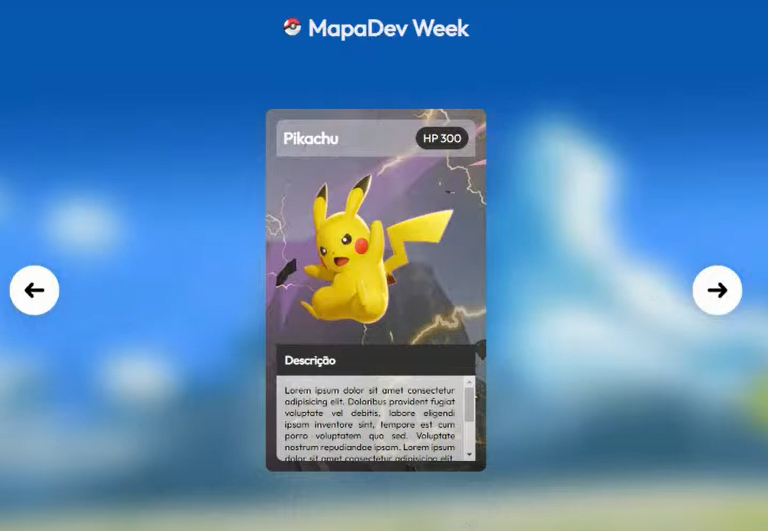

# Sobre o Projeto

É um projeto feito com o auxilio dos [Dev em Dobro](https://www.youtube.com/c/DevemDobro), onde o Objetivo é criar um slide de cards de determinado desenho, serie e etc.

## Projeto

O projeto final irá ficar assim:

## Tecnologias Utilizadas

- HTML
- CSS
- JAVASCRIPT
